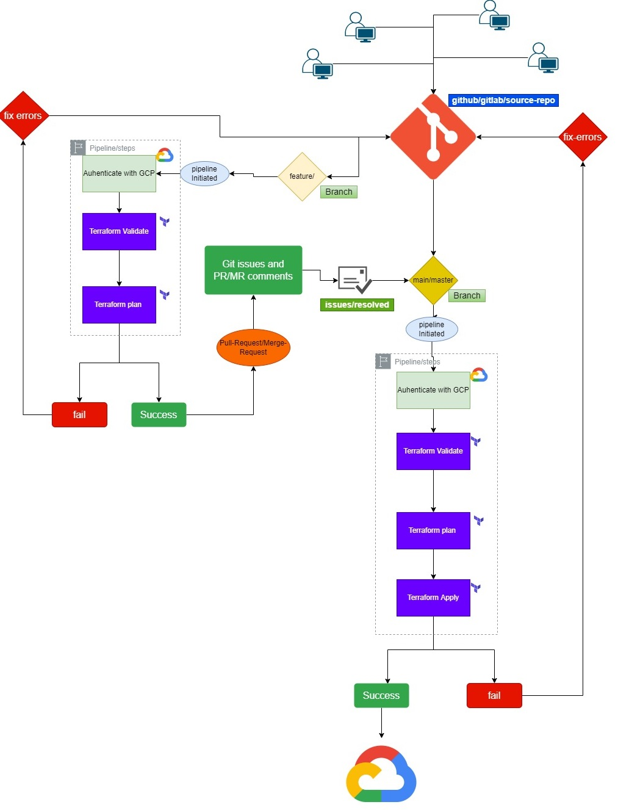

# CICD via Github

## The below describes the gitlab ci flow 


# CICD and Branching strategy

```
Continuous integration and delivery (CI/CD) is a development strategy that gets application
updates deployed in a fast, automated way. It differs from the traditional release life cycle by streamlining delivery through continuous integration, continuous delivery, and software configuration management to enable developers and operations teams to automate software delivery and infrastructure changes.  

A typical CI/CD workflow using Terraform and Git is depicted below.  Other CI/CD deployment pipelines will have similar workflows:
```



## Pre-requisites. 
1. TF: Bootstrap is created
2. TF: oidc is created, 
3. seed project is created
4. state bucket inside seed project is created
   
### Directory Structure: 

```
.github
├── actions
│   └── action.yml   
├── plan
│   └── action.yml    <--------- Calls actions/action.yml
└── workflows
    └── tf_workflow.yml  <------ Calls plan/action.yml
```

# How to use Github Workflow with Github. 

You just need to repeat the jobs inside workflows/tf_workflow.yml file, 

in below example, you can see under jobs, `bootstrap` is repeated with name `oidc` changed variables and so on.. 


```
name: TF

on:
  push:
    branches:
      - 'feature/**'
      - main
  pull_request:
  workflow_dispatch:

env:
  TF_LOG: WARN
  WIF_PROVIDER: "projects/666993235204/locations/global/workloadIdentityPools/66d-tf-gh-pool/providers/66d-tf-gh-provider"
  TF_SA: "org-terraform@prj-b-seed-22db.iam.gserviceaccount.com"
  GCS_BUCKET: "bkt-b-tfstate-e842"
  TERRAFOROM_VERSION: '1.2.9'

jobs:
  bootstrap:
    runs-on: ubuntu-latest
    permissions:
      contents: 'read'
      id-token: 'write'
    env: 
      ORG_ROOT: "66slz"
      APPLICATION_DIRECTORY: "0-bootstrap"
      TF_DIRECTORY: "0-bootstrap/66slz"
      ENVIRONMENT: "66slz"
      FILTER_ONE: '0-bootstrap/66slz/*.tfvars'
      FILTER_TWO: '0-bootstrap/66slz/*.md'
       
  
    steps:
      - uses: actions/checkout@v3

      - name: Terraform before Apply
        uses: ./.github/plan
        id: plan
        with:
          wif_provider: ${{ env.WIF_PROVIDER }}
          tf_sa: ${{ env.TF_SA }}
          gcs_bucket: ${{ env.GCS_BUCKET }}
          application_directory: ${{ env.APPLICATION_DIRECTORY }} # "0-bootstrap"
          filter_one: ${{ env.FILTER_ONE }} #'0-bootstrap/66slz/*.tfvars'
          filter_two: ${{ env.FILTER_TWO }} #'0-bootstrap/66slz/*.md'
          tf_directory: ${{ env.TF_DIRECTORY }} #"0-bootstrap/66slz"
          environment: ${{ env.ENVIRONMENT }} #"66slz"
          org_root: ${{ env.ORG_ROOT }}
          terraform_version: ${{ env.TERRAFOROM_VERSION }}
          github_token: ${{ secrets.GITHUB_TOKEN }}
            

      - name: Display Plan
        # if: steps.plan.outcome == 'success'
        id: display_plan
        working-directory: ${{ env.APPLICATION_DIRECTORY }}
        run: |
              if [[ -f "tf.plan" ]];
              then
                terraform show tf.plan 
              else
                echo "No Plan Generated"
              fi

      - name: Terraform Apply
        if: (github.ref == 'refs/heads/main' || github.event_name == 'pull_request') && (steps.display_plan.outcome == 'success')
        working-directory: ${{ env.APPLICATION_DIRECTORY }}
        run: |
             if [[ -f "tf.plan" ]];
             then
               terraform apply tf.plan
             else
               echo "No Plan Generated"
             fi

             

  oidc:
    runs-on: ubuntu-latest
    permissions:
      contents: 'read'
      id-token: 'write'
    env: 
      ORG_ROOT: "66slz"
      APPLICATION_DIRECTORY: "1-oidc"
      TF_DIRECTORY: "1-oidc/oidc"
      ENVIRONMENT: "oidc"
      FILTER_ONE: '1-oidc/oidc/*.tfvars'
      FILTER_TWO: '1-oidc/oidc/*.md'
       

    steps:
      - uses: actions/checkout@v3

      - name: Terraform before Apply
        uses: ./.github/plan
        id: plan
        with:
          wif_provider: ${{ env.WIF_PROVIDER }}
          tf_sa: ${{ env.TF_SA }}
          gcs_bucket: ${{ env.GCS_BUCKET }}
          application_directory: ${{ env.APPLICATION_DIRECTORY }}
          filter_one: ${{ env.FILTER_ONE }}
          filter_two: ${{ env.FILTER_TWO }}
          tf_directory: ${{ env.TF_DIRECTORY }}
          environment: ${{ env.ENVIRONMENT }}
          org_root: ${{ env.ORG_ROOT }}
          terraform_version: ${{ env.TERRAFOROM_VERSION }}
          github_token: ${{ secrets.GITHUB_TOKEN }}
            

      - name: Display Plan
        # if: steps.plan.outcome == 'success'
        id: display_plan
        working-directory: ${{ env.APPLICATION_DIRECTORY }}
        run: |
              if [[ -f "tf.plan" ]];
              then
                terraform show tf.plan 
              else
                echo "No Plan Generated"
              fi

      - name: Terraform Apply
        if: (github.ref == 'refs/heads/main' || github.event_name == 'pull_request') && (steps.display_plan.outcome == 'success')
        working-directory: ${{ env.APPLICATION_DIRECTORY }}
        run: |
             if [[ -f "tf.plan" ]];
             then
               terraform apply tf.plan
             else
               echo "No Plan Generated"
             fi


  org-policies:
    runs-on: ubuntu-latest
    permissions:
      contents: 'read'
      id-token: 'write'
    env: 
      ORG_ROOT: "66slz"
      APPLICATION_DIRECTORY: "2-org-policy"
      TF_DIRECTORY: "2-org-policy/organization"
      ENVIRONMENT: "organization"
      FILTER_ONE: '2-org-policy/organization/*.tfvars'
      FILTER_TWO: '2-org-policy/organization/*.md'
       

    steps:
      - uses: actions/checkout@v3

      - name: Terraform before Apply
        uses: ./.github/plan
        id: plan
        with:
          wif_provider: ${{ env.WIF_PROVIDER }}
          tf_sa: ${{ env.TF_SA }}
          gcs_bucket: ${{ env.GCS_BUCKET }}
          application_directory: ${{ env.APPLICATION_DIRECTORY }}
          filter_one: ${{ env.FILTER_ONE }}
          filter_two: ${{ env.FILTER_TWO }}
          tf_directory: ${{ env.TF_DIRECTORY }}
          environment: ${{ env.ENVIRONMENT }}
          org_root: ${{ env.ORG_ROOT }}
          terraform_version: ${{ env.TERRAFOROM_VERSION }}
          github_token: ${{ secrets.GITHUB_TOKEN }}
            

      - name: Display Plan
        # if: steps.plan.outcome == 'success'
        id: display_plan
        working-directory: ${{ env.APPLICATION_DIRECTORY }}
        run: |
             if [[ -f "tf.plan" ]];
             then
               terraform show tf.plan 
             else
               echo "No Plan Generated"
             fi

      - name: Terraform Apply
        if: (github.ref == 'refs/heads/main' || github.event_name == 'pull_request') && (steps.display_plan.outcome == 'success')
        working-directory: ${{ env.APPLICATION_DIRECTORY }}
        run: |
             if [[ -f "tf.plan" ]];
             then
               terraform apply tf.plan
             else
               echo "No Plan Generated"
             fi


             
  slz:
    runs-on: ubuntu-latest
    permissions:
      contents: 'read'
      id-token: 'write'
    env: 
      ORG_ROOT: "66slz"
      APPLICATION_DIRECTORY: "3-secure_landing_zone"
      TF_DIRECTORY: "3-secure_landing_zone/slz"
      ENVIRONMENT: "slz"
      FILTER_ONE: '3-secure_landing_zone/slz/*.tfvars'
      FILTER_TWO: '3-secure_landing_zone/slz/*.md'
       

    steps:
      - uses: actions/checkout@v3

      - name: Terraform before Apply
        uses: ./.github/plan
        id: plan
        with:
          wif_provider: ${{ env.WIF_PROVIDER }}
          tf_sa: ${{ env.TF_SA }}
          gcs_bucket: ${{ env.GCS_BUCKET }}
          application_directory: ${{ env.APPLICATION_DIRECTORY }}
          filter_one: ${{ env.FILTER_ONE }}
          filter_two: ${{ env.FILTER_TWO }}
          tf_directory: ${{ env.TF_DIRECTORY }}
          environment: ${{ env.ENVIRONMENT }}
          org_root: ${{ env.ORG_ROOT }}
          terraform_version: ${{ env.TERRAFOROM_VERSION }}
          github_token: ${{ secrets.GITHUB_TOKEN }}
            

      - name: Display Plan
        # if: steps.plan.outcome == 'success'
        id: display_plan
        working-directory: ${{ env.APPLICATION_DIRECTORY }}
        run: |
              if [[ -f "tf.plan" ]];
              then
                terraform show tf.plan 
              else
                echo "No Plan Generated"
              fi

      - name: Terraform Apply
        if: (github.ref == 'refs/heads/main' || github.event_name == 'pull_request') && (steps.display_plan.outcome == 'success')
        working-directory: ${{ env.APPLICATION_DIRECTORY }}
        run: |
             if [[ -f "tf.plan" ]];
             then
               terraform apply tf.plan
             else
               echo "No Plan Generated"
             fi


```
  
## How the high level workflow should look like, 


## and the respective job looks like this, 


