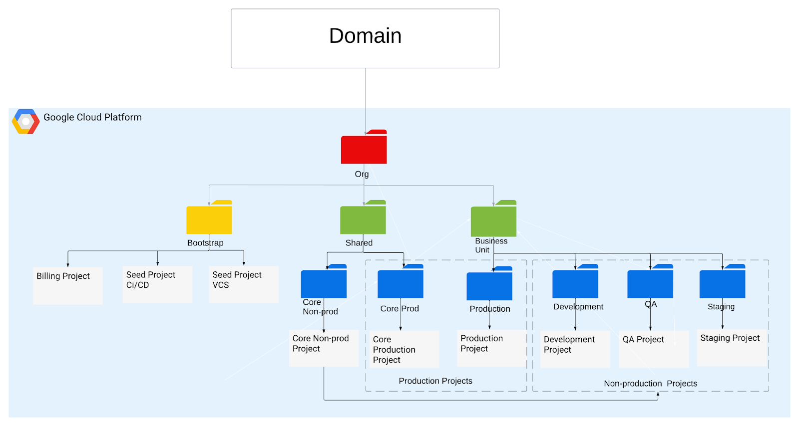

# Google Cloud Platform Foundations Framework

## Description

This repository contains a Terraform code base responsible for creating and managing a secure landing zone (SLZ) tenant, with customization options. The code base is represented by the diagram below.

`tfvars`: This object defines a group of one or more deployable variables which will span accross one or more environments. This object's data defines the EnvironmentSet it should be associated with, as well as networking requirements for these applications.

## Diagram


## Prerequisites

0-bootstrap, 1-oidc, 2-org-policy pipelines executed succsessfully

## How To

---

### Code Deployment
1. Check-out this repository onto your local workstation
1. Make sure your head is on the main branch of this repo
1. 2-scure-landing-zone contains all the codes for the SLZ deployment. Typically, tfvars under the slz folder needs to be updated based on the requirement.
1. Add additional code changes you wish to add, modify, or remove
1. Commit your changes to your created branch, making sure the commit message includes a commit message
1. Create a pull request of your branch into the main branch
1. The pull request will start a speculative plan to see if the changes you made will run correctly in terraform. If the plan passes, the cloudengineering team will merge the changes into the main branch, and the project creation process will start.

---

# Environment Set Definition

## Example (gcp-org-structure)
```
# --------------------------------------------------------------------------------------------------
# folder definitions
# --------------------------------------------------------------------------------------------------

org = "66slz.com"

billing_account = "01A26E-F5A54C-83E700"
org_id          = "organizations/270228063442"


org_folders           = ["shared", "bu-1-example"] # bu-1-{bu_name}
 subFolders = {
  shared_folders  = ["bu-1-core"]
  shared_nested   = ["ex-1-np-core", "ex-1-p-core"]
  bu_folders_nested = ["ex-1-dev", "ex-1-qa", "ex-1-stage", "ex-1-prod"]
}

# --------------------------------------------------------------------------------------------------
# project definitions
# --------------------------------------------------------------------------------------------------
projectName = {
  # Core-services Project
  nonprod_host = "ex-1-np-host"
  prod_host    = "ex-1-p-host"

  # Service Projects
  dev = "ex-1-dev-prj"
  qa = "ex-1-qa-prj"
  stage = "ex-1-stage-prj"
  production  = "ex-1-prod-prj"
}

# --------------------------------------------------------------------------------------------------
# common network definitions
# --------------------------------------------------------------------------------------------------
networkName = {
  nonprod_vpc = "slz-ex-np-vpc"
  prod_vpc    = "slz-ex-prod-vpc"
}


```

## Attribute Reference (gcp-org-structure)

* `rootFolders` (Required) (map(string)): Folders at the root level. This definition allows for the creation of root-level folders within the project.

* `subFolders` (Required) (map(list(string))): Folders at the sub-folder level. This definition allows for the creation of sub-folders within any root folder or sub-folder, allowing for nested file systems. Further customization may be done within the "Subfolder Structure" section of gcp-org-structure/main.tf.

* `projectName` (map(string)): Specifies names for host projects, including networking hosts.

* 'labels' (map(string)): Allows optional labels to be applied to host projects.

* `networkName` (Required) (map(object)): Specifies names for created VPCs.

* `networkSubnets` (Required) (list(map)(string)): The type of object being defined. For all environment sets this should have a value of `networkSubnets`. This definition allows for the creation of network subnets within the project. 

* `firewallrules` (Required) (map(object)): The type of object being defined for all environment sets this should have a value of `firewallrules` this definition allows for the creation of custom firewall rules within the project.