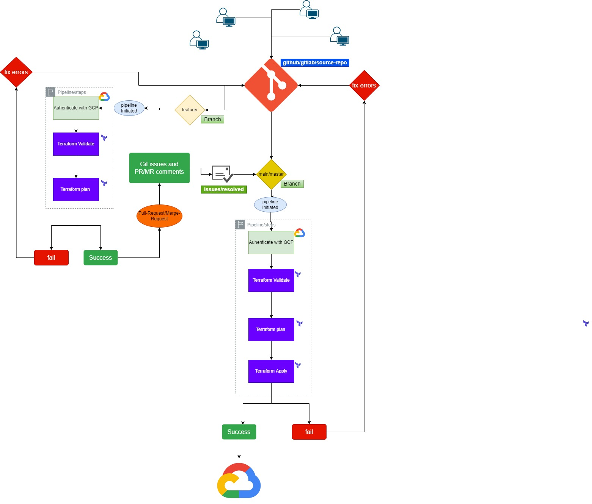

# CICD

```
Continuous integration and delivery (CI/CD) is a development strategy that gets application
updates deployed in a fast, automated way. It differs from the traditional release life cycle by streamlining delivery through continuous integration, continuous delivery, and software configuration management to enable developers and operations teams to automate software delivery and infrastructure changes.  

A typical CI/CD workflow using Terraform and Gitlab is depicted below.  Other CI/CD deployment pipelines will have similar workflows:
```


