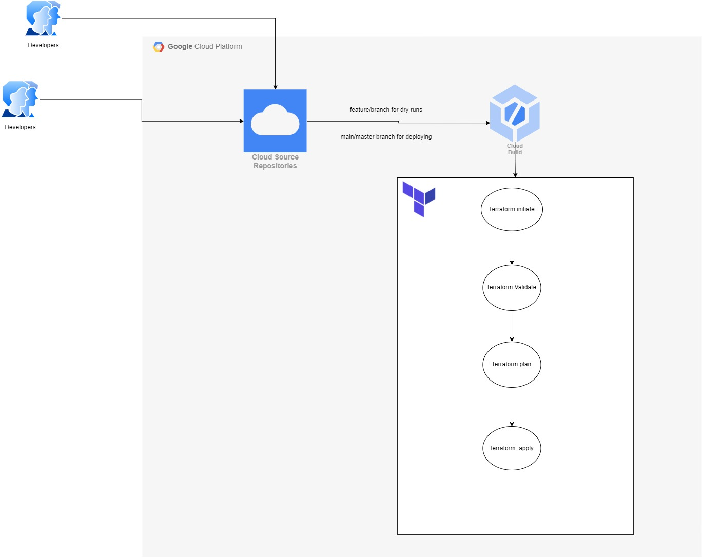
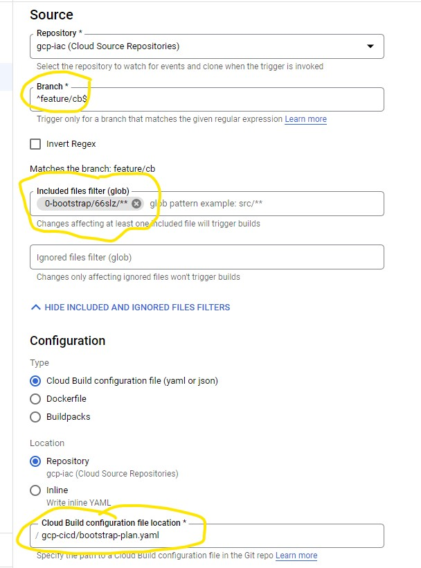
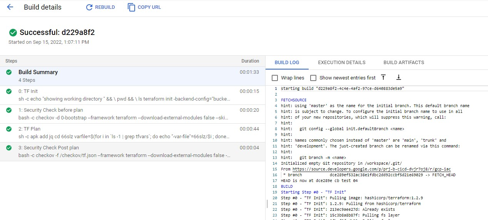

# CICD by Google's Cloud Build
## The Below how the CICD works and How to use it. 

Cloud Build is Google's Continous Integration and Deployment Tool. 

## CICD Flow



Link to GCP VCS

- [link to GCP VCS Terraform Code](https://source.cloud.google.com/prj-b-cicd-dvjr7oj8/gcp-iac)

Link to Github VCS
- [link to Github VCS Terraform Code](https://github.com/66degrees/66d-slz)

All the Infrastructure as code resides in the VCS. 

---
# CICD and Branching strategy

```
Continuous integration and delivery (CI/CD) is a development strategy that gets application
updates deployed in a fast, automated way. It differs from the traditional release life cycle by streamlining delivery through continuous integration, continuous delivery, and software configuration management to enable developers and operations teams to automate software delivery and infrastructure changes.  

A typical CI/CD workflow using Terraform and Git is depicted below.  Other CI/CD deployment pipelines will have similar workflows:
```


---

## Prerequisites. 

1. Bootstrap is deployed
2. cicd-project is created. 
3. log bucket is created in cicd project
4. TF-Cloud-build service account created. 
5. TF-cloud-build have billing account and group admin permission. ( Apart from other org-level permissions )
6. Seed Project is created
7. state-bucket is created in seed project. 


## Starting with repository

### Directory Structure 

```
├── 0-bootstrap
│   ├── 66slz <----- tfvars Directory
│   
└── 1-oidc
│   ├──oidc <----- tfvars Directory
│   
└── gcp-cicd <----------- all Cloud-build Trigger manifests. 
    ├── bootstrap-apply.yaml
    ├── bootstrap-plan.yaml
    ├──    
    ├──
```
* the cicd yaml files are located in gcp-cicd directory. 
* for each application/service there are two yaml files,
  * (application)-apply.yaml
  * (application)-plan.yaml
* Plan runs for all feature branches, 
* and Apply Runs for and when merged with Main branch. 

## How to use these yaml files with Google's Cloud-build. 

Repository is categorized into several sections like 
   * 0-bootstrap
   * 1-oidc ( not required if vcs is Google's Source Repository )
   * 2-org-policies
   * 3-secure-landing-zone
   * 

We need to create two triggers and two yaml files 
  * (application)-apply.yaml
  * (application)-plan.yaml

### trigger feature/ branches 



    1. Above trigger is for feature/ branches, 
    2. Create same for main/master branches. 

## Cloud build for feature/ branches : DRY-RUN TRIGGER   
From the below example, you only need to update the `Substitutions` or variables. 

```
substitutions:
  _ORG_ROOT: "66slz"
  _TF_IMAGE: "hashicorp/terraform:1.2.9"
  _TF_DIRECTORY: "0-bootstrap/66slz"
  _APPLICATION_DIRECTORY: "0-bootstrap"
  _ENVIRONMENT: "66slz"
  _TF_STATE_BKT: "bkt-b-tfstate-e842"
  _LOG_BKT: "tf-cloudbuilder-build-logs-prj-b-cicd-dvjr7oj8"
```
Complete yaml file

```
steps:
  - id: 'TF Init'
    name: $_TF_IMAGE
    entrypoint: 'sh'
    dir: $_APPLICATION_DIRECTORY
    args:
    - '-c'
    - |
       echo "showing working directory " && \
       pwd && \
       ls

       terraform init -backend-config="bucket=$_TF_STATE_BKT" -backend-config="prefix=$_ORG_ROOT/$_TF_DIRECTORY"
    volumes:
      - name: tf
        path: '/checkov'

  - id: 'TF Plan'
    name: $_TF_IMAGE
    entrypoint: 'sh'
    dir: $_APPLICATION_DIRECTORY
    args:
    - '-c'
    - |
      apk add jq

      cd $_ENVIRONMENT

      varfile=$(for i in `ls -1 | grep tfvars`; do echo "-var-file"=$_ENVIRONMENT/$$i ; done  | xargs)

      cd ..

      terraform plan $$varfile -out tf.plan && \
      terraform show -json tf.plan | jq '.' > /checkov/tf.json
    volumes:
      - name: tf
        path: '/checkov'

logsBucket: 'gs://$_LOG_BKT/$_ORG_ROOT/$_TF_DIRECTORY'
options:
 logging: GCS_ONLY
 logStreamingOption: STREAM_ON
substitutions:
  _ORG_ROOT: "66slz"
  _TF_IMAGE: "hashicorp/terraform:1.2.9"
  _TF_DIRECTORY: "0-bootstrap/66slz"
  _APPLICATION_DIRECTORY: "0-bootstrap"
  _ENVIRONMENT: "66slz"
  _TF_STATE_BKT: "bkt-b-tfstate-e842"
  _LOG_BKT: "tf-cloudbuilder-build-logs-prj-b-cicd-dvjr7oj8"
```
## Cloud build for main/master branch : APPLY TRIGGER

```
steps:
  - id: 'TF Init'
    name: $_TF_IMAGE
    entrypoint: 'sh'
    dir: $_APPLICATION_DIRECTORY
    args:
    - '-c'
    - |
       echo "showing working directory " && \
       pwd && \
       ls

       terraform init -backend-config="bucket=$_TF_STATE_BKT" -backend-config="prefix=$_ORG_ROOT/$_TF_DIRECTORY"
    volumes:
      - name: tf
        path: '/checkov'

  - id: 'TF Plan'
    name: $_TF_IMAGE
    entrypoint: 'sh'
    dir: $_APPLICATION_DIRECTORY
    args:
    - '-c'
    - |
      apk add jq

      cd $_ENVIRONMENT

      varfile=$(for i in `ls -1 | grep tfvars`; do echo "-var-file"=$_ENVIRONMENT/$$i ; done  | xargs)

      cd ..

      terraform plan $$varfile -out tf.plan && \
      terraform show -json tf.plan | jq '.' > /checkov/tf.json
    volumes:
      - name: tf
        path: '/checkov'

  - id: 'TF Apply'
    name: $_TF_IMAGE
    entrypoint: 'sh'
    dir: $_APPLICATION_DIRECTORY
    args:
    - '-c'
    - |
      terraform apply tf.plan
    volumes:
      - name: tf
        path: '/checkov'


logsBucket: 'gs://$_LOG_BKT/$_ORG_ROOT/$_TF_DIRECTORY'
options:
 logging: GCS_ONLY
 logStreamingOption: STREAM_ON
substitutions:
  _ORG_ROOT: "66slz"
  _TF_IMAGE: "hashicorp/terraform:1.2.9"
  _TF_DIRECTORY: "0-bootstrap/66slz"
  _APPLICATION_DIRECTORY: "0-bootstrap"
  _ENVIRONMENT: "66slz"
  _TF_STATE_BKT: "bkt-b-tfstate-e842"
  _LOG_BKT: "tf-cloudbuilder-build-logs-prj-b-cicd-dvjr7oj8"
```


## About the Logs and State Files of Cloud Build and Terraform respectively. 

### LOGS
All Pipelines are configured to dump all the build logs its own directory reserved in GCS Bucket  `"gs://tf-cloudbuilder-build-logs-prj-b-cicd-dvjr7oj8/"`
```
gs://tf-cloudbuilder-build-logs-prj-b-cicd-dvjr7oj8/np-build-logs/
gs://tf-cloudbuilder-build-logs-prj-b-cicd-dvjr7oj8/np-dry-build-logs/
gs://tf-cloudbuilder-build-logs-prj-b-cicd-dvjr7oj8/np-dry-wl-build-logs/
gs://tf-cloudbuilder-build-logs-prj-b-cicd-dvjr7oj8/np-wl-build-logs/
gs://tf-cloudbuilder-build-logs-prj-b-cicd-dvjr7oj8/p-build-logs/
gs://tf-cloudbuilder-build-logs-prj-b-cicd-dvjr7oj8/p-dry-build-logs/
gs://tf-cloudbuilder-build-logs-prj-b-cicd-dvjr7oj8/p-dry-wl-build-logs/
gs://tf-cloudbuilder-build-logs-prj-b-cicd-dvjr7oj8/p-wl-build-logs/
```

This Allows us to move away from Terraform State locking. 
Which means, you can run SLZ and Workload ; prod and non-prod Pipelines parallely. 

### State Files

All the State files are stored at respective GCS Directory directory 

```
gs://tf-cloudbuilder-build-logs-prj-b-cicd-dvjr7oj8/terraform/non-prod-workload/   # Workload Non Prod
gs://tf-cloudbuilder-build-logs-prj-b-cicd-dvjr7oj8/terraform/non-prod/            # slz non-prod
gs://tf-cloudbuilder-build-logs-prj-b-cicd-dvjr7oj8/terraform/prod-workload/       # Workload Prod
gs://tf-cloudbuilder-build-logs-prj-b-cicd-dvjr7oj8/terraform/prod/                # slz prod

```

## How the Trigger jobs look, 

