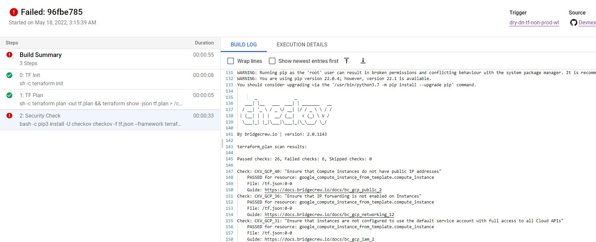

# Policy-as-code: Checkov

### Checkov scans cloud infrastructure configurations to find misconfigurations before they're deployed.

## What is Checkov?


Checkov is a static code analysis tool for scanning infrastructure as code (IaC) files for misconfigurations that may lead to security or compliance problems. Checkov includes more than 750 predefined policies to check for common misconfiguration issues. Checkov also supports the creation and contribution of custom policies.

## Custom policies

Custom policies can be created to check cloud resources based on configuration attributes (in Python or YAML or connection states (in YAML). For composite policies, Checkov creates a cloud resource connection graph for deep misconfiguration analysis across resource relationships.


## Compliance with Industry Standards

In addition, Checkov scans for compliance with common industry standards such as the Center for Internet Security (CIS) and Amazon Web Services (AWS) Foundations Benchmark.

## Integrates seamlessly with Bridgecrew

Checkov integrates with advanced features in the Bridgecew platform. You can sign up for a free Bridgecrew account by running Checkov with no arguments and following the CLI prompts, or directly via the Bridgecrew website. Bridgecrew extends Checkov’s capabilities to provide runtime scanning and visibility, native VCS integrations, compliance benchmarking, and more.

## Runtime Scanning

Bridgecrew can validate the same Checkov IaC policies against your runtime cloud environments in AWS, Azure and Google Cloud, allowing you to find and fix issues in existing deployments and detect cloud drifts. Read more in Bridgecrew’s documentation.

## How Checkov is implemented within Devnext! 

```
1. Dockerfile in the repository is used to create container which is used for scanning the terraform plan for any security and compliance breaches before the terraform code is applied.
 
2. Only if the checkov marks the report as "Successful/Pass" the terraform code is allowed to create the required infrastructure. 
```

## How to create the Docker image and save it in Google's Container Registry. 

    1. $ cd /checkov 
    2. $ docker build -f Dockerfile -t gcr.io/dn-slz-iac-01/checkov/ubuntu-checkov:<tag> . 
    3. $ docker push gcr.io/dn-slz-iac-01/checkov/ubuntu-checkov:<tag>


#### Checkov integrated with Cloud Build


### Example cloud build (ci/cd) steps integrated with Checkov

```
steps:
  - id: 'TF Init'
    name: 'hashicorp/terraform:1.1.9'
    entrypoint: 'sh'
    dir: slz/prod
    args:
    - '-c'
    - |
       terraform init
    volumes:
      - name: tf
        path: '/checkov'

  - id: 'TF Plan'
    name: 'hashicorp/terraform:1.1.9'
    entrypoint: 'sh'
    dir: slz/prod
    args:
    - '-c'
    - |      
      apk add jq 
           
       terraform plan -out tf.plan && terraform show -json tf.plan | jq '.' > /checkov/tf.json
    volumes:
      - name: tf
        path: '/checkov'

  - name: gcr.io/dn-slz-iac-01/checkov/ubuntu-checkov:2.0.1084
    id: Security Check
    dir: '/checkov'  
    args:
      - '-c'
      - |
        pip3 install -U checkov
         
        checkov -f tf.json --framework terraform_plan --skip-check CKV2_GCP_5,CKV_GCP_76,CKV_GCP_37
    entrypoint: bash
    volumes:
      - name: tf
        path: '/checkov'

  - id: 'TF Apply Prod'
    name: 'hashicorp/terraform:1.1.9'
    entrypoint: 'sh'
    dir: slz/prod
    args:
    - '-c'
    - |      
       terraform apply tf.plan
    volumes:
      - name: tf
        path: '/checkov'

logsBucket: 'gs://dn-tf-state/p-build-logs'
options:
 logging: GCS_ONLY
 logStreamingOption: STREAM_ON
 ```


    1. "TF Init": In the First step, Terraform initializes in the mentioned Directory. 

    2. "TF Plan":  In the Second Step Terraform Creates a plan and saves the plan in "/checkov" volume. 

    3. "Security Check": Checkov Now scans the plan and looks for Standard Security breaches, and if it finds any, it reports and cloud-build halts the next step. Else, 

    4. "TF Apply Prod":  Cloud build proceeds with next step wchich is Apply. 