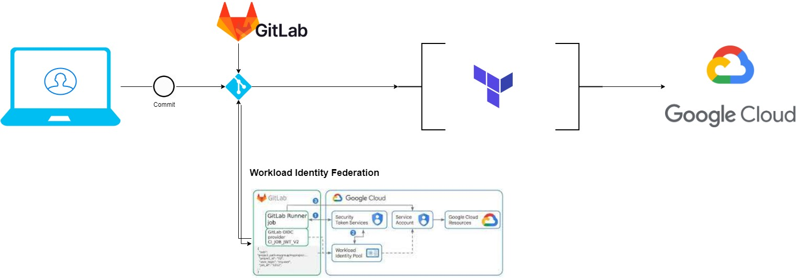
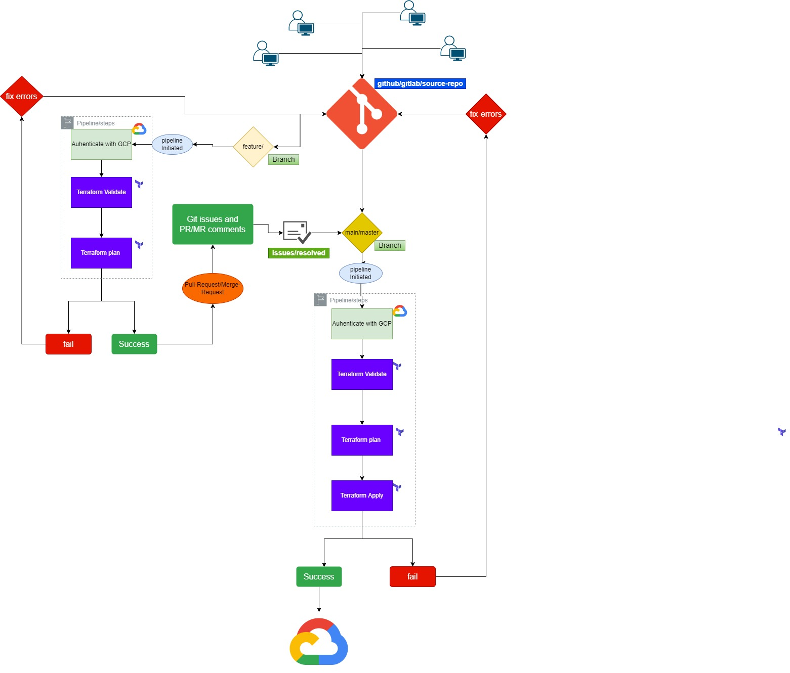
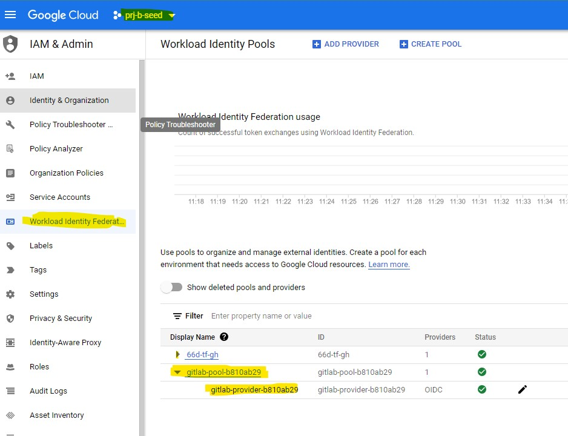
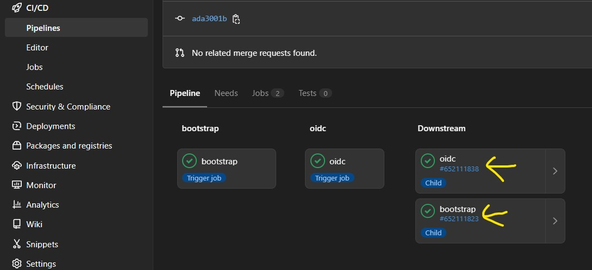
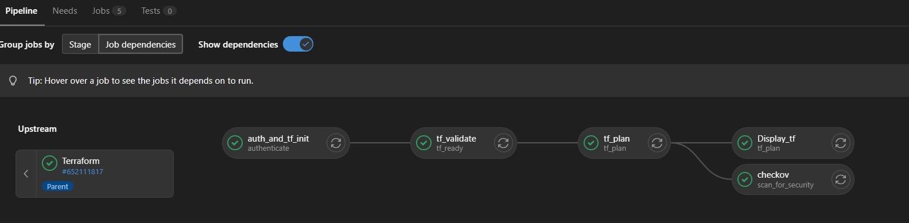
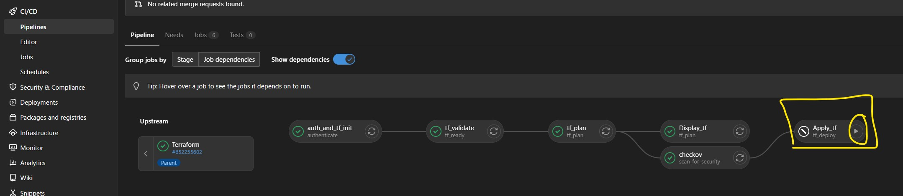
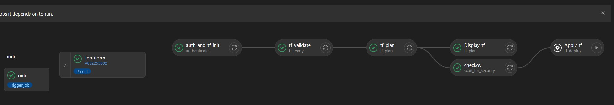

# CI/CD with Gitlab

## The Flow 




# CICD and Branching strategy

```
Continuous integration and delivery (CI/CD) is a development strategy that gets application
updates deployed in a fast, automated way. It differs from the traditional release life cycle by streamlining delivery through continuous integration, continuous delivery, and software configuration management to enable developers and operations teams to automate software delivery and infrastructure changes.  

A typical CI/CD workflow using Terraform and Git is depicted below.  Other CI/CD deployment pipelines will have similar workflows:
```



## Pre-requisite

1. TF: Bootstrap should be deployed
2. TF: OIDC should be deployed. 
   1. which set ups the required Workload Identity Federation (WIF) so that Gitlab can exchange token with Google's STS service. 
   2. Once Setup you can visit the Seed Project and navigate to IAM section and then Workload Identity Federation
      1. where you'll be able to see the WIF Setup. 
   
      2. Also you'll get the WIF URL when you click on the WIF pool name. 

## Starting with Repository. 

1. The Pipeline is desigend with two Gitlab-ci.yml files one act as the parent and other act as the child. 
2. And a script `run_gcp_sts.sh` which extracts the required authenticated token from Google. 
   1. The parent ci file is supposed to keep in root of the repository. 
   2. and child at the resource/application folder, for example. 
        ```
        ├── 0-bootstrap
        │   ├── .gitlab-ci.yml (child ci file )
        ├── 1-oidc
        │   ├── .gitlab-ci.yml ( child ci file )
        ├── Gitlab_README.md
        ├── .gitlab-ci.yml ( parent ci file)
        └── run_gcp_sts.sh
        ``` 

## How to use the child CI file

1. Take a reference from below child ci file in 0-bootstrap directory. 
2. You need to make a replica of this section in every application directory for example, 
   1. 0-bootstrap
   2. 1-oidc
   3. 2-org-policies
   4. etc
3. What it does is, ( when branch is feature/ or hotfix/ )
   1. Creates makes the authentication with GCP and gets the required token in exchange.
   2. Initializes the backend 
   3. Validates the TF code
   4. Takes the Plan
   5. Avails the Plan for Display
   6. and Finally applies the TF plan. 
   7. Apply is automatically displayed if the branch is main/master. 


   ```
    stages:
      - authenticate
      - tf_ready
      - tf_plan
      - tf_deploy
    
    auth_and_tf_init: 
      image: google/cloud-sdk:alpine
      stage: authenticate
      # tags:
      #   - kubernetes
      rules:
        - if: $CI_COMMIT_TAG
          when: never
        - if: '$CI_COMMIT_BRANCH =~ /(^hotfix|^feature)/'
          changes:
            - ${TF_DIRECTORY}/**/*
            - .gitlab-ci.yml
          allow_failure: true      
        - if: '$CI_COMMIT_BRANCH =~ /(^main$|^master$)/'
          changes:
            - ${TF_DIRECTORY}/**/*
            - .gitlab-ci.yml
          allow_failure: true
      before_script: 
        - echo $CI_JOB_JWT_V2 > .ci_job_jwt_file
        - echo ${GCP_SERVICE_ACCOUNT}
        - gcloud iam workload-identity-pools create-cred-config ${GCP_WORKLOAD_IDENTITY_PROVIDER}
          --service-account=${GCP_SERVICE_ACCOUNT}
          --output-file=.gcp_temp_cred.json
          --credential-source-file=`pwd`/.ci_job_jwt_file
        - gcloud auth login --cred-file=`pwd`/.gcp_temp_cred.json --project ${PROJECT_ID}
        - apk add jq
        - chmod +x ./run_gcp_sts.sh
        - ./run_gcp_sts.sh 
        - export CLOUDSDK_AUTH_ACCESS_TOKEN=`cat token.json`
        - export GOOGLE_APPLICATION_CREDENTIALS=`pwd`/.gcp_temp_cred.json
        - gcloud config set pass_credentials_to_gsutil true
        - ls -altr
        - wget https://releases.hashicorp.com/terraform/${TF_VERSION}/terraform_${TF_VERSION}_linux_amd64.zip
        - apk add unzip
        - unzip terraform_${TF_VERSION}_linux_amd64.zip
        - cp terraform /usr/local/bin/
        - terraform version
      script: 
        - cd ${APPLICATION_DIRECTORY}
        - terraform init -backend-config="bucket=${STATE_BUCKET}" -backend-config="prefix=${ORG_ROOT}/${TF_DIRECTORY}"
      artifacts:
        public: false
        expire_in: 1 hour
        paths: 
        - terraform
        - ${APPLICATION_DIRECTORY}
        - token.json
        - .gcp_temp_cred.json
        - .ci_job_jwt_file
    
    tf_validate: 
      image: google/cloud-sdk:alpine
      stage: tf_ready
      extends: auth_and_tf_init
      needs: 
        - auth_and_tf_init
      dependencies: 
        - auth_and_tf_init
      before_script: 
        - mv terraform /usr/local/bin/
        - ls -altr
      script: 
        - cd ${APPLICATION_DIRECTORY}
        - terraform validate 
    
    tf_plan: 
      image: google/cloud-sdk:alpine
      stage: tf_plan
      extends: auth_and_tf_init
      needs: 
        - tf_validate
        - auth_and_tf_init
      dependencies: 
        - auth_and_tf_init
      before_script: 
        - mv terraform /usr/local/bin/
        - gcloud auth login --cred-file=`pwd`/.gcp_temp_cred.json --project ${PROJECT_ID}
        - export CLOUDSDK_AUTH_ACCESS_TOKEN=`cat token.json`
        - export GOOGLE_APPLICATION_CREDENTIALS=`pwd`/.gcp_temp_cred.json
        - gcloud config set pass_credentials_to_gsutil true
        - apk add jq
      script: 
        - cd ${TF_DIRECTORY} 
        - varfile=$(for i in `ls -1 | grep tfvars`; do echo "-var-file"=${ENVIRONMENT}/$i ; done  | xargs)
        - cd .. && echo $varfile && ls -altr
        - terraform plan $varfile -out tf.plan
        - terraform show -json tf.plan | jq '.' > tf.json
      artifacts:
        public: false    
        expire_in: 1 day
        paths: 
        - ${APPLICATION_DIRECTORY}
        - tf.json
        - tf.plan
    
    Display_tf: 
      image: google/cloud-sdk:alpine
      stage: tf_plan
      extends: tf_plan
      needs: 
        - tf_plan
        - auth_and_tf_init
      dependencies: 
        - auth_and_tf_init
        - tf_plan
      before_script:
        - mv terraform /usr/local/bin/
      script:
        - cd ${APPLICATION_DIRECTORY}
        - terraform show tf.plan
    
    Apply_tf: 
      image: google/cloud-sdk:alpine
      stage: tf_deploy
      extends: tf_plan
      needs: 
        - tf_plan
        - auth_and_tf_init
      dependencies: 
        - auth_and_tf_init
        - tf_plan
      # tags:
      #   - kubernetes
      rules:
        - if: '$CI_COMMIT_BRANCH =~ /(^main$|^master$)/'
          changes:
            - ${TF_DIRECTORY}/**/*
          when: manual
          allow_failure: true
      before_script: 
        - mv terraform /usr/local/bin/
        - gcloud auth login --cred-file=`pwd`/.gcp_temp_cred.json --project ${PROJECT_ID}
        - export CLOUDSDK_AUTH_ACCESS_TOKEN=`cat token.json`
        - export GOOGLE_APPLICATION_CREDENTIALS=`pwd`/.gcp_temp_cred.json
        - gcloud config set pass_credentials_to_gsutil true
      script:
        - cd ${APPLICATION_DIRECTORY}
        - terraform apply tf.plan
    ```

   Note- No changes required in this child ci file. 

## How to use the Parent CI file

1. From the below parent Ci file you need to update the  
   1. variable section and 
   2. keep adding below section, 
        ```
        bootstrap:
          stage: bootstrap
          # tags:
          #   - kubernetes
          variables:
            ORG_ROOT: "66slz"
            APPLICATION_DIRECTORY: "0-bootstrap"
            TF_DIRECTORY: "0-bootstrap/66slz"
            ENVIRONMENT: "66slz"
          trigger:
              include:
                  - local: '${APPLICATION_DIRECTORY}/.gitlab-ci.yml'
          rules:
              - changes:
                  - ${TF_DIRECTORY}/**/*   
        ```
        Keep repeating it for all application directories you have. 
    
    Parent gitlab-ci.yml file
    ```
    stages:
      - bootstrap
      - oidc
      - org_policies
      - slz
      - vpn
      - workloads
    
    
    variables:
      TF_VERSION: 1.2.9
      GCP_WORKLOAD_IDENTITY_PROVIDER: 'projects/666993235204/locations/global/workloadIdentityPools/gitlab-pool-b810ab29/providers/gitlab-provider-b810ab29'
      GCP_SERVICE_ACCOUNT: 'org-terraform-gitlab-prj-b-see@prj-b-seed-22db.iam.gserviceaccount.com'
      PROJECT_NUMBER: '666993235204'
      PROJECT_ID: 'prj-b-seed-22db'
      POOL_ID: 'gitlab-pool-b810ab29' 
      PROVIDER_ID: 'gitlab-provider-b810ab29' 
      SERVICE_ACCOUNT_EMAIL: 'org-terraform-gitlab-prj-b-see@prj-b-seed-22db.iam.gserviceaccount.com'
      STATE_BUCKET: "bkt-b-tfstate-e842"
    
    
    bootstrap:
      stage: bootstrap
      # tags:
      #   - kubernetes
      variables:
        ORG_ROOT: "66slz"
        APPLICATION_DIRECTORY: "0-bootstrap"
        TF_DIRECTORY: "0-bootstrap/66slz"
        ENVIRONMENT: "66slz"
      trigger:
          include:
              - local: '${APPLICATION_DIRECTORY}/.gitlab-ci.yml'
      rules:
          - changes:
              - ${TF_DIRECTORY}/**/*
    
    oidc:
      stage: oidc
      # tags:
      #   - kubernetes
      variables:
        ORG_ROOT: "66slz"
        APPLICATION_DIRECTORY: "1-oidc"
        TF_DIRECTORY: "1-oidc/oidc"
        ENVIRONMENT: "oidc"
      trigger:
          include:
              - local: '${APPLICATION_DIRECTORY}/.gitlab-ci.yml'
      rules:
          - changes:
              - ${TF_DIRECTORY}/**/*
    
    
    ```
---
---

### With this example the following Gitlab CICD is created.

1. From above reference, it creates two parent job  
   1. Bootstrap &
   2. oidc
   
   3. and if you click on the Downstream pipeline id, you'll see respective application directory will run the child pipelines which does the below ( when branch is feature/ or hotfix/ ), 
        ```
        1. Creates makes the authentication with GCP and gets the required token in exchange.
        2. Initializes the backend 
        3. Validates the TF code
        4. Takes the Plan
        5. Avails the Plan for Display
        7. and Finally applies the TF plan. 
        8. Apply is automatically displayed if the branch is main/master. 
        ```
   

    4. Apply is automatically displayed if there is a merge request or if the branch is main/master.
        1. Apply is kept Manual so applied only when a authorized person can review and apply it. 
        

        2. How it looks from top level
        


